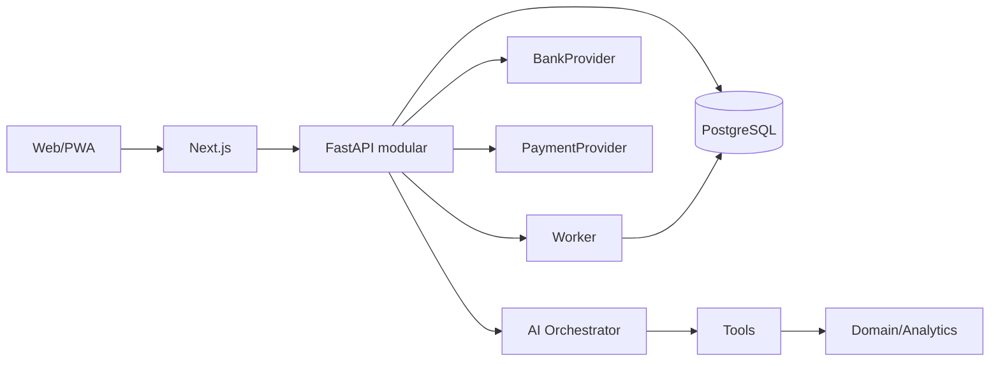

# Arquitetura

## Visão

Rayo começa como monólito modular com três processos:

- Next.js para interface;
- FastAPI para API e casos de uso;
- worker assíncrono quando sincronização/jobs entrarem.

PostgreSQL é a fonte de verdade. Redis será introduzido somente com sessão/cache/fila que o exija.



## Contextos

Toda chamada autenticada possui:

- `UserScope`: identidade e permissões;
- `FinancialContext`: um perfil, conjunto autorizado ou “Tudo”;
- correlation id.

Mutações sempre exigem um perfil-alvo único. “Tudo” é agregação de leitura.

## Módulos

`auth`, `users`, `financial_profiles`, `banking`, `accounts`, `cards`, `transactions`, `categories`, `budgets`, `bills`, `payments`, `debts`, `goals`, `subscriptions`, `receivables`, `calendar`, `analytics`, `simulations`, `insights`, `financial_health`, `financial_plan`, `assistant`, `notifications`, `integrations`, `audit`.

Um módulo só ganha camadas/pastas quando tiver comportamento. Regra de dependência:

```text
API/worker → application → domain ← infrastructure adapters
```

## Consistência

- transação de banco por caso de uso;
- optimistic locking em planos/simulações;
- idempotência em imports, webhooks e pagamentos;
- outbox junto do primeiro fluxo assíncrono que precise garantia;
- estado desconhecido é reconciliado, nunca repetido cegamente.

## Critério de extração

Microserviço só é considerado quando medição demonstrar escala diferente, isolamento obrigatório, dependência tecnológica indispensável ou equipe/deploy independente. Até lá, fronteiras de módulo e filas internas preservam evolução.
