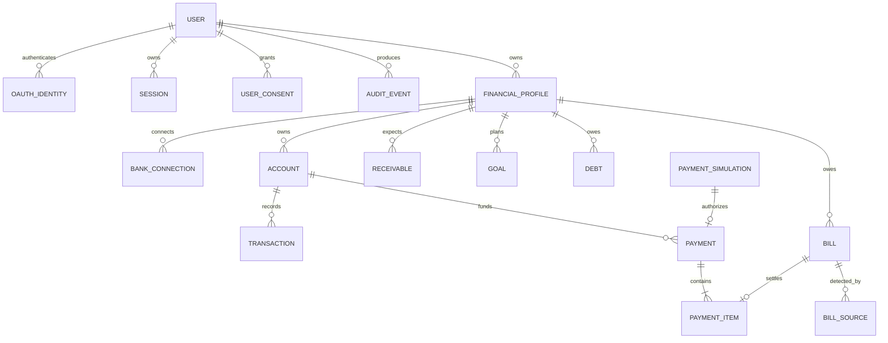

# Banco de dados

## Convenções

- PostgreSQL;
- UUID/ULID para IDs;
- `NUMERIC(19,2)` e moeda ISO para dinheiro;
- UTC para instantes, fuso e competência explícitos;
- `user_id` em dados do tenant;
- `financial_profile_id` em todo dado financeiro;
- IDs externos únicos por provider/conexão;
- versionamento otimista em planos e simulações;
- auditoria append-only.

## Núcleo relacional

## Tabelas implementadas na Etapa 2

- `users` e `oauth_identities`;
- `sessions`, persistindo hashes — nunca o token opaco recebido pelo navegador;
- `financial_profiles`, com índice parcial que limita um perfil pessoal ativo por usuário;
- `accounts`, inicialmente apenas com origem manual;
- `user_consents`, versionados e revogáveis;
- `audit_events`, com metadados por allowlist.

A migração `20260724_0001` é aplicada com `python -m alembic upgrade head`.

## Ledger manual — Etapa 3A

A migração `20260724_0002` adiciona:

- `categories`, com oito categorias padrão e categorias personalizadas vinculadas ao perfil;
- `transactions`, sempre vinculada a usuário, perfil e conta;
- valor positivo em `NUMERIC(19,2)` e natureza explícita `INCOME`, `EXPENSE` ou `TRANSFER`;
- data do evento e competência mensal normalizada para o primeiro dia;
- estados `PENDING`, `POSTED` e `VOIDED`;
- versão para impedir sobrescrita silenciosa em edições concorrentes;
- índices para contexto, data, status, conta e categoria.

Transferências não compõem totais de receita/despesa. Exclusão manual muda o estado para
`VOIDED`, preservando rastreabilidade e auditoria.

## Cartões e faturas — Etapa 3B

- `credit_cards`: cartão manual segregado por usuário e perfil, com fechamento, vencimento e limite;
- `card_invoices`: competência, vencimento, estado e referência idempotente ao pagamento;
- `transactions.credit_card_id`: identifica compras no cartão sem fingir que o cartão é conta;
- `transactions.card_invoice_id`: vincula compras e pagamento à mesma fatura.

Compras no cartão são despesas. O pagamento da fatura é uma transferência e não entra novamente
no total de despesas. Repetir a confirmação de uma fatura já paga não cria outra transação.

## Transferências e estornos — Etapa 3C

Uma transferência própria gera duas transações `TRANSFER` com o mesmo `transfer_group_id`:
`OUTFLOW` na conta de origem e `INFLOW` na conta de destino. A operação possui chave idempotente
e nenhum dos lados entra em receitas ou despesas.

Um estorno referencia a transação original por `reversal_of_transaction_id`, que é único. O valor
reduz a natureza contábil original em vez de aparecer como nova renda ou novo gasto. Repetir a
confirmação retorna o mesmo estorno.

## Splits e regras de categoria — Etapa 3D

`transaction_splits` distribui o valor de uma transação por categorias e posições. A soma das
partes precisa ser exatamente igual ao valor do lançamento pai; o pai continua sendo a única
movimentação usada nos totais de receita e despesa.

`category_rules` pertence ao usuário e ao perfil financeiro. A regra compara texto normalizado,
respeita prioridade e só preenche a categoria quando o lançamento não recebeu uma explicitamente.
Categorias incompatíveis com a natureza da transação são ignoradas.

## Perfis financeiros

- `PERSONAL`: no máximo um ativo por usuário;
- `BUSINESS`: vários por usuário;
- CPF/CNPJ protegido e mascarado;
- agregação “Tudo” não cria linhas nem remove o vínculo de origem.

## Cobranças

`Bill` é canônico; `BillSource` preserva detecções de banco, DDA, email, fatura ou manual. Dedupe exato usa external id/barcode/Pix. Dedupe forte usa documento, valor e vencimento. Candidatos ambíguos exigem revisão.

## Pagamentos

`PaymentSimulation` expira e registra componentes calculados. `Payment` guarda o lote interno. `PaymentItem` representa cada obrigação/operação externa. Autorização é vinculada ao hash exato da simulação; recibo/referência chega após reconciliação.

## Índices iniciais

- `(user_id, financial_profile_id, occurred_on desc)` em transações;
- `(financial_profile_id, status, due_date)` em bills/receivables;
- unicidade por `(provider, connection_id, external_id)`;
- `(user_id, created_at desc)` em auditoria/insights;
- índices parciais para estados ativos quando o volume justificar.

Não criar tabelas de módulos futuros antes do incremento que as usa.
