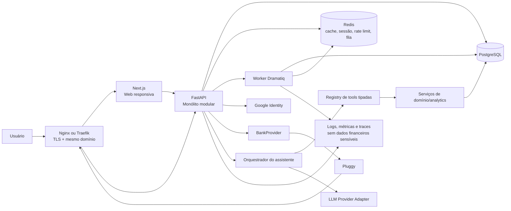
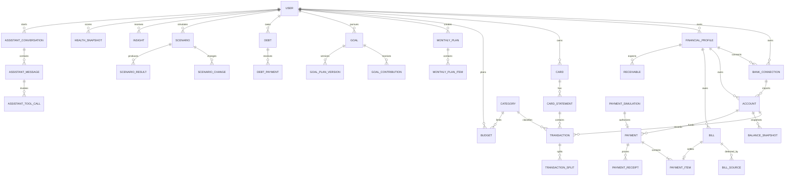
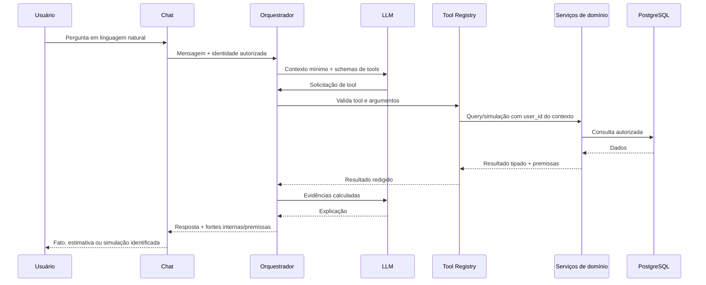
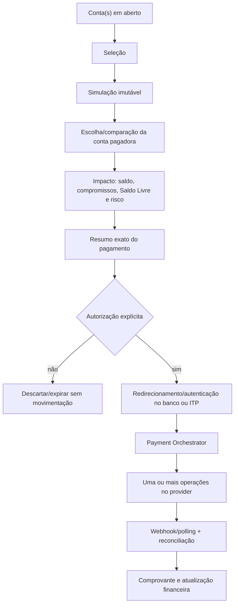

# Rayo Finanças — Plano de Produto e Arquitetura

> Documento inicial de arquitetura e produto.  
> Status: Etapas 1, 2 e incrementos 3A/3B/3C/3D implementados; roadmap restante em validação  
> Atualizado em: 24/07/2026  
> Escopo atual: fundação, identidade, onboarding e ledger manual reconciliável executáveis

## 1. Resumo executivo

Rayo Finanças é uma aplicação web de gestão financeira pessoal que transforma dados bancários e registros manuais em explicações simples, previsões e próximos passos. O produto não será um extrato mais bonito nem um ERP doméstico: sua unidade de valor é uma decisão financeira melhor.

Fluxo central:

```text
Banco ou registro manual
        ↓
Transações normalizadas
        ↓
Organização e categorização
        ↓
Cálculos determinísticos
        ↓
Diagnóstico, insights e simulações
        ↓
Recomendação justificada
        ↓
Ação explicitamente autorizada
        ↓
Acompanhamento
```

Princípios:

1. **Clareza antes de densidade:** cada tela responde a poucas perguntas importantes.
2. **Ação antes de relatório:** toda descoberta relevante sugere um próximo passo seguro.
3. **Python calcula; IA interpreta:** cálculos financeiros críticos pertencem ao backend.
4. **Simular não é alterar:** cenários são temporários até confirmação explícita.
5. **Privacidade por padrão:** coletar, exibir e registrar apenas o necessário.
6. **Monólito modular primeiro:** fronteiras claras sem o custo operacional de microserviços.
7. **Entrega vertical e testável:** cada etapa deixa o produto executável.
8. **Simulação antes da movimentação:** toda operação financeira pode ser analisada sem ser executada.
9. **IA nunca movimenta dinheiro:** o chat prepara propostas; somente o fluxo estruturado e autenticado inicia pagamentos.
10. **Contexto financeiro explícito:** toda leitura e ação respeita o perfil selecionado — Pessoal, Empresa ou Tudo.

## 2. Decisões e hipóteses que precisam de validação

As decisões abaixo permitem planejar sem bloquear o projeto. Devem ser validadas antes de sua etapa de implementação.

| Tema | Decisão inicial | Motivo |
|---|---|---|
| Mercado inicial | Pessoas físicas e pequenos negócios no Brasil, moeda-base BRL | Permite PF/PJ sem transformar o produto em ERP |
| Modelo de negócio | Freemium ainda não detalhado | Não bloquear o núcleo do produto com billing prematuro |
| Plataforma | Web responsiva/PWA-ready; app nativo fora do MVP | Uma base de interface e menor custo inicial |
| Idioma | pt-BR no MVP, estrutura pronta para i18n | Foco de mercado sem espalhar strings pelo código |
| Unidade monetária | `NUMERIC(19,2)` e código ISO 4217; nunca `float` | Precisão financeira e futura multi-moeda |
| Fuso horário | Fuso do usuário, padrão `America/Sao_Paulo`; persistência UTC | Fechamentos mensais corretos |
| Agregação de família/casal | Fora do MVP | Exige autorização compartilhada e muda o modelo de privacidade |
| Investimentos avançados | Fora do MVP | Patrimônio pode começar com saldos e ativos manuais |
| Open Finance | Um adaptador Pluggy no MVP, sem acoplamento de domínio | Reduz tempo de integração e preserva substituição futura |
| Processamento assíncrono | Dramatiq + Redis quando a sincronização bancária entrar | Mais simples que Celery para o volume inicial |
| IA | Provedor substituível; assistente limitado a tools autorizadas | Evita lock-in e acesso irrestrito aos dados |
| Contexto PF/PJ | `FinancialProfile` como boundary obrigatório | Um usuário pode ter perfil pessoal e várias empresas |
| Pagamentos | Simulação no backend; iniciação futura via ITP/provider, nunca custódia | Preserva segurança, autorização bancária e substituição do fornecedor |

### Complexidade rejeitada nesta fase

- **Microserviços:** adicionariam rede, consistência distribuída e operação sem necessidade comprovada.
- **Kafka/event streaming:** eventos internos e filas Redis atendem sincronização e jobs iniciais.
- **Data lake/warehouse:** consultas analíticas em PostgreSQL, snapshots e Pandas atendem o MVP.
- **GraphQL:** REST tipado com OpenAPI é suficiente e reduz superfície.
- **Kubernetes:** containers em serviço gerenciado ou VM bem operada são suficientes no início.
- **Classificação por IA generativa:** regras e classificação determinística são auditáveis; IA pode sugerir, nunca ocultar a origem.
- **Agente autônomo:** alterações financeiras serão comandos explícitos com confirmação, não decisões autônomas.
- **Event sourcing completo:** auditoria imutável e snapshots resolvem a necessidade sem reconstruir todo o estado por eventos.

## 3. Visão do produto

### 3.1 Promessa

**“Entenda para onde seu dinheiro vai e saiba o que fazer a seguir.”**

Landing page:

- Headline: **“Seu dinheiro entra. Mas você sabe para onde ele vai?”**
- Subheadline: **“Conecte suas contas e transforme seus gastos em decisões melhores para sua vida financeira.”**
- CTA: **“Começar gratuitamente”**

### 3.2 Resultados desejados pelo usuário

- Saber quanto possui e quanto pode gastar sem comprometer o mês.
- Identificar rapidamente categorias, recorrências e hábitos que pressionam o orçamento.
- Planejar metas e dívidas com consequências visíveis.
- Comparar o comportamento atual com períodos equivalentes.
- Receber alertas úteis antes do problema, não apenas um relatório depois.
- Fazer perguntas em linguagem natural e receber respostas rastreáveis aos próprios dados.
- Sentir progresso financeiro sem julgamento ou falsa precisão.

### 3.3 Métricas de produto

North Star inicial: **percentual de usuários ativos que concluem ao menos uma ação financeira orientada por dados por mês**.

Ações qualificadas:

- ajustar um orçamento;
- categorizar uma transação relevante;
- criar ou atualizar uma meta;
- escolher um cenário de pagamento de dívida;
- reduzir/cancelar um gasto recorrente;
- confirmar um plano mensal;
- resolver um insight.

Métricas de apoio:

- ativação: conexão bancária ou importação/registro manual + primeiro dashboard visto;
- tempo até o primeiro insight útil;
- cobertura de categorização;
- usuários com planejamento mensal completo;
- retenção em 4 e 12 semanas;
- percentual de insights vistos, dispensados e convertidos em ação;
- taxa de metas “no ritmo”;
- redução de déficit mensal projetado;
- confiança/frescor dos dados;
- falhas e latência de sincronização bancária;
- respostas do assistente com dados insuficientes ou tool errors.

Métricas de vaidade como número de gráficos vistos não serão objetivo.

## 4. Personas e problemas

### Persona A — “Tenho renda, mas não sei para onde vai”

- Recebe salário, usa conta e cartão, mas fecha o mês sem clareza.
- Alterna entre extratos, planilhas abandonadas e memória.
- Precisa de categorização, comparações e previsão de fechamento.
- Sucesso: entende os três maiores desvios e sabe quanto ainda pode gastar.

### Persona B — “Quero organizar planos reais”

- Tem uma viagem, reserva ou entrada de imóvel como objetivo.
- Não sabe se o aporte é compatível com renda e despesas.
- Precisa comparar cenários sem destruir o plano atual.
- Sucesso: escolhe prazo e aporte sustentáveis, acompanhando o progresso.

### Persona C — “Quero sair das dívidas”

- Possui empréstimos, parcelamentos ou rotativo.
- Não enxerga custo total, prioridade ou efeito de pagamentos extras.
- Precisa comparar avalanche e snowball com linguagem simples.
- Sucesso: entende qual dívida custa mais e confirma um plano possível.

### Persona D — “Já controlo, mas quero decidir melhor”

- Tem boa disciplina e procura consolidação, tendências e projeções.
- Precisa de dados confiáveis e explicações sem ruído.
- Sucesso: detecta mudanças cedo e ajusta metas/orçamentos.

### Persona E — “Preciso separar minha vida pessoal da empresa”

- É profissional autônomo, MEI ou responsável por um pequeno negócio.
- Mistura pagamentos PF/PJ, perde visibilidade do capital de giro e dos recebimentos.
- Precisa alternar entre visão consolidada e cada perfil sem operar um ERP.
- Sucesso: entende caixa pessoal e empresarial, evita mistura acidental e antecipa contas a pagar/receber.

### Problemas transversais

- dados fragmentados entre instituições;
- compras com descrições pouco compreensíveis;
- cartão confundido com conta e risco de dupla contagem;
- comparação injusta entre mês completo e mês em andamento;
- orçamento visto tarde demais;
- metas desconectadas do fluxo de caixa;
- simulações que viram alterações acidentais;
- recomendações genéricas sem base nos dados;
- vergonha ou ansiedade provocada por tom julgador.

## 5. Proposta de valor e experiência

### 5.1 Diferenciais

1. **Visão acionável:** “você usou 91% do lazer e faltam 12 dias” em vez de só “R$ 910”.
2. **Planejamento conectado:** orçamento, metas, dívidas e projeções usam a mesma base determinística.
3. **Simulações seguras:** comparar alternativas antes de confirmar mudanças.
4. **Assistente com ferramentas limitadas:** conversa natural sem acesso SQL nem liberdade para inventar valores.
5. **Transparência:** todo número mostra período, origem, atualização e hipótese relevante.

### 5.2 Princípios de UX

- Priorizar uma pergunta principal por bloco.
- Revelar detalhes progressivamente.
- Mostrar valores absolutos junto a percentuais.
- Distinguir realizado, previsto e simulado por texto, cor e ícone — nunca apenas por cor.
- Comparar períodos equivalentes; mês em andamento deve ser comparado aos mesmos dias dos meses anteriores.
- Explicar fórmulas e premissas em linguagem simples.
- Usar tom calmo, direto e não moralista.
- Oferecer estado vazio orientado: “Conecte uma conta” ou “Adicione manualmente”.
- Sempre exibir atualização e cobertura dos dados.
- Pedir confirmação em mudanças permanentes; ações destrutivas pedem confirmação reforçada.
- Suportar teclado, leitores de tela, contraste WCAG 2.2 AA e redução de movimento.

## 6. Escopo por horizonte

O produto completo é maior que seu primeiro lançamento. A arquitetura prepara as fronteiras, mas as tabelas e integrações só são criadas quando um incremento utilizável precisar delas.

### Core não negociável

- segregação por usuário e `FinancialProfile`;
- valores e projeções calculados deterministicamente;
- simulação sem mutação;
- autorização inequívoca para qualquer mudança ou movimentação;
- IA sem SQL e sem autoridade de pagamento;
- idempotência, auditoria e consentimento.

### MVP — beta privada

- landing page, política de privacidade e termos;
- login Google e onboarding;
- perfil Pessoal e um perfil Empresa opcional;
- uma ou mais conexões via Pluggy e alternativa de cadastro manual;
- contas, cartões, saldos e transações;
- normalização, deduplicação, busca, filtros e categorização;
- dashboard principal e comparação mensal;
- orçamentos por categoria;
- planejamento mensal;
- metas, aportes e simulador de meta;
- dívidas manuais, painel, avalanche/snowball e simulação de pagamento extra;
- cenários temporários e confirmação de alterações suportadas;
- patrimônio básico;
- projeções de 3, 6 e 12 meses;
- Financial Health Score explicável;
- Financial Insights Engine determinístico;
- contas a pagar manuais/importadas e Saldo Livre;
- configurações, consentimentos, revogação e exclusão de conta;
- auditoria de ações sensíveis e chamadas de tools.

### V2

- assistente financeiro com tools de leitura e simulação aprovadas;
- confirmação estruturada para atualização de meta/orçamento;
- Central de Contas, Financial Inbox e deduplicação multi-fonte;
- contas a receber e fluxo projetado para PJ;
- assinaturas, calendário financeiro e “Posso comprar?”;
- simulação de pagamentos e comparação de contas pagadoras;
- iniciação de pagamento via provider/ITP, atrás de feature flag e aprovação de segurança.

### V3

- contas compartilhadas/família;
- investimentos com cotação, imposto ou recomendação;
- múltiplos BankProviders/PaymentProviders;
- Gmail para detecção de cobranças com consentimento separado;
- automações e notificações avançadas;
- declaração fiscal;
- negociação de dívida;
- marketplace de produtos financeiros;
- classificação generativa automática;
- app nativo;
- multi-país e Open Finance fora do Brasil;
- chat por voz;
- aconselhamento financeiro personalizado com promessa de resultado.

### Experimental

- extração assistida de cobranças e documentos;
- classificação por modelos com revisão humana;
- Next Best Action personalizado;
- iniciação/agendamento de pagamentos em lote quando o provider oferecer suporte seguro.

## 7. Arquitetura de alto nível



### 7.1 Responsabilidades

- **Next.js:** apresentação, acessibilidade, estado de interface e consumo da API; não contém regras financeiras críticas.
- **FastAPI:** autenticação, autorização, casos de uso, contratos REST, validação e composição dos módulos.
- **Domínio:** entidades, políticas e comandos independentes de HTTP, ORM ou fornecedor bancário.
- **Analytics:** cálculos determinísticos versionados e testados; usa SQL para agregações e Pandas/NumPy quando a forma tabular justificar.
- **Worker:** sincronizações, normalização em lote, recomputação de snapshots e geração de insights.
- **PostgreSQL:** fonte de verdade transacional.
- **Redis:** sessão/cache/limites/fila; nunca fonte única de dados financeiros.
- **Adaptadores externos:** Google, BankProvider, LLM e notificações atrás de interfaces.

### 7.2 Fronteiras e regra de dependência

```text
API/UI adapters → Application services → Domain
Infrastructure adapters ────────────────→ Domain ports
Analytics application services ─────────→ Domain repositories
```

O domínio não importa FastAPI, SQLAlchemy, Pluggy nem SDK de LLM. Comunicação entre módulos começa com chamadas internas e eventos de aplicação. Só uma necessidade operacional medida justificará extrair um serviço.

### 7.3 Consistência e jobs

- Transações de banco usam unit of work no limite do caso de uso.
- Webhooks são autenticados, persistidos com chave idempotente e respondidos rapidamente.
- Processamento pesado ocorre no worker com retry exponencial e dead-letter operacional.
- Jobs são idempotentes por `provider + external_id + operation/version`.
- Eventos relevantes podem usar uma tabela `outbox_events`; sua introdução ocorre junto da primeira integração assíncrona, não antes.
- Cache tem TTL curto e invalidação após mutações; respostas financeiras críticas podem ignorar cache se estiverem desatualizadas.

## 8. Estrutura de diretórios proposta

```text
rayo-financas/
├── apps/
│   ├── web/
│   │   ├── src/
│   │   │   ├── app/                 # rotas Next.js
│   │   │   ├── components/
│   │   │   ├── features/            # dashboard, budgets, goals...
│   │   │   ├── lib/                 # API client, formatters
│   │   │   ├── hooks/
│   │   │   ├── styles/
│   │   │   └── test/
│   │   ├── public/
│   │   └── package.json
│   └── api/
│       ├── app/
│       │   ├── main.py
│       │   ├── core/                 # config, security, db, errors
│       │   ├── shared/               # money, time, pagination, events
│       │   ├── modules/
│       │   │   ├── auth/
│       │   │   ├── users/
│       │   │   ├── financial_profiles/
│       │   │   ├── banking/
│       │   │   ├── accounts/
│       │   │   ├── cards/
│       │   │   ├── transactions/
│       │   │   ├── categories/
│       │   │   ├── budgets/
│       │   │   ├── bills/
│       │   │   ├── payments/
│       │   │   ├── receivables/
│       │   │   ├── subscriptions/
│       │   │   ├── calendar/
│       │   │   ├── planning/
│       │   │   ├── goals/
│       │   │   ├── debts/
│       │   │   ├── scenarios/
│       │   │   ├── analytics/
│       │   │   ├── insights/
│       │   │   ├── assistant/
│       │   │   ├── notifications/
│       │   │   ├── audit/
│       │   │   └── integrations/
│       │   ├── workers/
│       │   └── tests/
│       ├── alembic/
│       └── pyproject.toml
├── packages/
│   ├── ui/                           # componentes compartilhados web
│   └── api-client/                   # cliente gerado do OpenAPI
├── infra/
│   ├── docker/
│   ├── proxy/
│   └── deploy/
├── docs/
│   ├── adr/
│   ├── product/
│   ├── api/
│   ├── threat-model/
│   └── runbooks/
├── .github/workflows/
├── compose.yaml
├── plan.md
└── todo.md
```

### Estrutura interna de um módulo backend

```text
module/
├── domain/          # entidades, value objects, políticas, ports
├── application/     # commands, queries, DTOs, serviços
├── infrastructure/  # ORM, repositórios, providers
└── api/             # rotas e schemas HTTP
```

Módulos pequenos podem começar com menos pastas e ser divididos quando crescerem. A arquitetura não deve produzir diretórios vazios.

## 9. Módulos do backend

| Módulo | Responsabilidade |
|---|---|
| `auth` | OAuth Google, sessões, logout, revogação e autorização |
| `users` | perfil, moeda, fuso, preferências, consentimentos e exclusão |
| `financial_profiles` | contextos Pessoal/Empresa, associação do usuário e seleção consolidada |
| `banking` | conexões, consentimento, sync, webhooks e `BankProvider` |
| `accounts` | contas, saldos e snapshots |
| `cards` | cartões, faturas, limites e prevenção de dupla contagem |
| `transactions` | ingestão, normalização, edição manual, split, transferências e deduplicação |
| `categories` | taxonomia padrão/pessoal e regras de categorização |
| `budgets` | limites mensais, status realizado/projetado e alertas |
| `bills` | Financial Inbox, contas a pagar, fontes, estados e deduplicação |
| `payments` | simulação, autorização, orquestração, provider e reconciliação |
| `receivables` | contas a receber e projeção de caixa, com foco inicial em PJ |
| `subscriptions` | recorrências confirmadas, custo mensal/anual e mudanças de preço |
| `calendar` | compromissos e saldo previsto por data |
| `planning` | renda prevista, compromissos, margem e fechamento mensal |
| `goals` | metas, aportes, progresso e plano escolhido |
| `debts` | contratos, parcelas, amortização e estratégias |
| `scenarios` | premissas temporárias, resultados, comparação e aplicação confirmada |
| `analytics` | agregações, comparações, recorrência, projeções e score |
| `insights` | regras, prioridade, explicações, feedback e cooldown |
| `assistant` | conversas, orquestração, tools, confirmações e auditoria |
| `notifications` | preferências e entrega futura de avisos |
| `audit` | trilha append-only de eventos sensíveis e financeiros |
| `integrations` | adaptadores Google, Pluggy, LLM e observabilidade |

## 10. Modelo de dados inicial

### 10.1 Convenções

- Chaves primárias UUID/ULID.
- Toda entidade pertencente ao usuário contém `user_id`; dados financeiros também contêm `financial_profile_id`.
- Consultas recebem `UserScope` e `FinancialContext`; o contexto pode ser um perfil, um conjunto autorizado ou “Tudo”.
- Datas instantâneas em UTC; competência financeira e data local armazenadas explicitamente.
- Dinheiro em `NUMERIC(19,2)` com `currency CHAR(3)`.
- Taxas em `NUMERIC`, nunca ponto flutuante binário.
- `created_at`, `updated_at` e, quando necessário, `deleted_at`.
- IDs externos têm unicidade composta com conexão/provedor.
- Origem registrada como `manual`, `bank_provider`, `calculated` ou `system`.
- Payload bruto externo não é a fonte de leitura da aplicação e tem retenção mínima.
- Alterações sensíveis geram registro de auditoria append-only.

### 10.2 Entidades principais

**Identidade e privacidade**

- `users`: identidade interna, email normalizado, nome, locale, timezone, moeda-base, estado.
- `financial_profiles`: usuário, tipo (`PERSONAL`, `BUSINESS`), nome, CPF/CNPJ criptografado/tokenizado, moeda, fuso e estado.
- `oauth_identities`: usuário, provedor, subject externo, metadados mínimos.
- `user_consents`: tipo, versão, concedido/revogado em, base legal.
- `audit_events`: ator, ação, alvo, resultado, request/correlation id e metadados redigidos.
- `data_deletion_requests`: solicitação, estado, prazo e conclusão.

**Bancos e movimentações**

- `bank_connections`: usuário, perfil financeiro, provider, instituição, external item id, token criptografado/referência, estado, último sync, consentimento.
- `sync_runs`: conexão, cursor, início/fim, estado, contagens e erro sanitizado.
- `accounts`: conexão opcional, instituição, tipo/subtipo, nome mascarado, moeda, saldo atual, origem.
- `account_balance_snapshots`: conta, instante, saldo.
- `cards`: conta/conexão opcional, bandeira, final mascarado, limite, fechamento, vencimento.
- `card_statements`: cartão, competência, valores total/pago, vencimento, estado.
- `transactions`: conta, cartão/fatura opcionais, external id, data efetiva, descrição original/normalizada, valor assinado, tipo, estado, origem, categoria, merchant, recorrência e hash de deduplicação.
- `transaction_splits`: transação, categoria, valor e descrição.
- `transfer_links`: transação de saída e entrada relacionadas.
- `merchants`: nome canônico, aliases e ícone/metadados não sensíveis.
- `categories`: usuário opcional para padrão global, pai, nome, tipo e estado.
- `categorization_rules`: usuário, prioridade, condições estruturadas e categoria de destino.
- `recurring_series`: usuário, merchant/descrição, frequência, valor esperado/faixa, próxima ocorrência e confiança.

**Contas, recebimentos e pagamentos**

- `bills`: usuário, perfil financeiro, credor/documento protegido, descrição, valor, vencimento, status, barcode/Pix protegidos, fonte, external id e datas de detecção/confirmação/pagamento.
- `bill_sources`: conta, fonte, identificador externo e evidência; permite unir várias detecções em uma cobrança canônica.
- `bill_dedup_candidates`: par de cobranças, score, motivos, decisão automática/humana e versão da regra.
- `receivables`: usuário, perfil financeiro, cliente, valor, vencimento, status, descrição, origem e transação de recebimento opcional.
- `payment_simulations`: usuário, perfil/contexto, itens, conta pagadora, saldo atual/pós-pagamento, compromissos, Saldo Livre, risco, premissas, versão e expiração.
- `payments`: usuário, perfil de obrigação, conta pagadora, provider, valor total, estado, idempotency key, autorização, autenticação bancária e referências externas.
- `payment_items`: pagamento, bill, valor, operação externa, estado e erro seguro; um lote interno pode gerar várias operações no provider.
- `payment_authorizations`: pagamento/simulação, resumo imutável, hash, usuário, instante, expiração e evidência do consentimento.
- `payment_receipts`: item/pagamento, referência do provider, metadados e objeto criptografado quando houver comprovante.

**Planejamento**

- `budgets`: usuário, competência, categoria, limite, rollover opcional e estado.
- `monthly_plans`: usuário, competência, renda prevista, estado e versão.
- `monthly_plan_items`: plano, tipo (`income`, `essential`, `debt`, `goal`, `variable`), referência opcional, valor, realizado/previsto.
- `goals`: usuário, nome, tipo, valor alvo, valor reservado, data alvo, aporte planejado, prioridade, estado.
- `goal_contributions`: meta, data, valor, origem e transação opcional.
- `goal_plan_versions`: meta, versão, aporte/data, premissas, ativo desde e confirmação.
- `debts`: usuário, instituição, descrição, tipo, principal original, saldo, parcela, parcelas totais/restantes, taxa, CET, datas, origem e estado.
- `debt_payments`: dívida, data, principal, juros, encargos, total e transação opcional.
- `debt_rate_periods`: dívida, vigência e taxa; permite mudanças sem apagar histórico.

**Analytics e decisões**

- `net_worth_snapshots`: usuário, data, ativos, passivos e patrimônio.
- `financial_health_snapshots`: usuário, competência/data, total, subescores, confiança e versão do algoritmo.
- `projection_runs`: usuário, horizonte, data-base, versão, premissas e estado.
- `projection_points`: execução, data, patrimônio, dívida, reserva, metas e caixa.
- `insights`: usuário, regra/versão, severidade, título, corpo estruturado, evidências, CTA, estado, validade e dedupe key.
- `insight_feedback`: insight, ação (`helpful`, `dismissed`, `acted`) e data.
- `scenarios`: usuário, nome, tipo, base version, estado (`draft`, `confirmed`, `expired`, `discarded`) e validade.
- `scenario_changes`: cenário, variável, referência, valor anterior e simulado.
- `scenario_results`: cenário, métrica, período, valor e explicação.
- `change_confirmations`: usuário, tipo de comando, payload hash, resumo, expiração, confirmado em e idempotency key.

**Assistente**

- `assistant_conversations`: usuário, título, estado e retenção.
- `assistant_messages`: conversa, papel, conteúdo redigido/criptografado conforme política, status e modelo.
- `assistant_tool_calls`: mensagem, tool, argumentos redigidos, resultado resumido, latência, estado, versão e correlation id.
- `assistant_pending_actions`: conversa, comando proposto, resumo humano, payload hash, expiração, estado e confirmação.

### 10.3 Relacionamentos



### 10.4 Cuidados de modelagem

- Pagamento de fatura não é despesa adicional: compras compõem despesas; pagamento é transferência/liquidação.
- Transferências entre contas próprias não alteram receita/despesa nem patrimônio.
- Estorno referencia a transação original quando possível.
- Transações pendentes e confirmadas não podem ser somadas duas vezes.
- Edição do usuário prevalece sobre recategorização automática e registra origem.
- Consolidação “Tudo” agrega perfis autorizados, mas nunca remove `financial_profile_id` nem permite mutação sem perfil-alvo explícito.
- Mistura PF/PJ gera alerta e confirmação específica; nunca é bloqueada ou executada silenciosamente.
- `Payment` não marca `Bill` como pago antes da confirmação/reconciliação do provider.
- A mesma cobrança pode ter várias `bill_sources`, mas somente um `Bill` canônico visível.
- Exclusão lógica é usada apenas quando histórico precisa ser preservado; solicitação LGPD efetua anonimização/exclusão conforme obrigação legal.

## 11. Páginas e navegação do frontend

### Públicas

- `/` Landing page.
- `/privacidade`, `/termos`, `/seguranca`.
- `/login` e callback de autenticação.

### Onboarding

- Boas-vindas e objetivo principal.
- Consentimento e explicação de dados.
- Conectar banco ou começar manualmente.
- Revisar contas encontradas.
- Confirmar categorias iniciais.
- Definir primeira prioridade: entender gastos, meta ou dívida.

### Aplicação autenticada

- seletor global de contexto: `Tudo`, `Pessoal`, cada empresa e, quando aplicável, conta específica;
- `/dashboard` — visão geral e próximos passos.
- `/transacoes` — lista, busca, filtros, edição, split e regras.
- `/contas` — contas e saldos.
- `/cartoes` — cartões e faturas.
- `/orcamentos` — limites e projeções.
- `/contas-a-pagar` — Financial Inbox, revisão e seleção de cobranças.
- `/pagamentos/simular` — impacto, conta pagadora e comparação.
- `/pagamentos/[id]` — estado, itens, falhas parciais e comprovantes.
- `/contas-a-receber` — recebimentos e caixa projetado para PJ.
- `/calendario` — compromissos e saldo previsto por dia.
- `/assinaturas` — recorrências confirmadas e custo anual.
- `/e-se` — cenários temporários.
- `/posso-comprar` — à vista vs parcelado vs esperar.
- `/planejamento` — mês previsto, compromissos e margem.
- `/metas` e `/metas/[id]` — progresso e simulações.
- `/dividas` e `/dividas/[id]` — contratos, estratégias e antecipação.
- `/analises` — comparação entre períodos e categorias.
- `/futuro` — projeções e premissas.
- `/patrimonio` — ativos, passivos e evolução.
- `/insights` — feed priorizado e histórico.
- `/assistente` — chat e ações pendentes.
- `/configuracoes/perfil`.
- `/configuracoes/conexoes`.
- `/configuracoes/privacidade`.
- `/configuracoes/notificacoes`.

### Landing page detalhada

1. Hero com dor concreta, CTA e prova visual do dashboard.
2. Situações reais: “o cartão fechou maior”, “o salário sumiu”, “a meta nunca avança”.
3. Demonstração visual com estados realistas, sem prometer números universais.
4. Benefícios: enxergar, antecipar, decidir.
5. Três passos: conectar/importar → organizar → agir.
6. Integração bancária e alternativa manual.
7. Exemplos de insights com origem e contexto.
8. Segurança e privacidade em linguagem não jurídica.
9. Depoimentos claramente marcados como placeholders até existirem relatos reais.
10. FAQ.
11. CTA final e footer.

## 12. Dashboard principal

### 12.1 Perguntas respondidas

- Quanto tenho hoje?
- Quanto entrou e saiu neste mês?
- Quanto ainda posso gastar?
- Qual é meu Saldo Livre depois dos compromissos?
- Quais contas vencem e qual perfil é responsável?
- O mês tende a fechar positivo?
- O que mudou de forma relevante?
- Qual ação merece atenção agora?

### 12.2 Hierarquia

**Cabeçalho**

- saudação curta;
- seletor de competência;
- atualização dos dados e estado de sincronização;
- ação “Adicionar”;
- ocultar/mostrar valores.

**Primeira dobra**

1. Patrimônio atual, com tendência e cobertura.
2. Saldo do mês: receitas, despesas e economia.
3. “Disponível até o fim do mês”, com premissas.
4. Financial Health Score com explicação, não como nota de crédito.
5. Insight prioritário com um CTA.

**Diagnóstico**

- evolução diária acumulada: realizado vs mês anterior equivalente vs projeção;
- despesas por categoria;
- orçamento consumido com dias restantes;
- recorrências e próximos compromissos;
- metas e dívidas que exigem atenção.

**Progresso**

- taxa de economia;
- evolução de patrimônio;
- metas no ritmo/fora do ritmo;
- resumo do plano mensal.

### 12.3 Métricas e fórmulas

- **Patrimônio:** ativos reconhecidos − saldo devedor. Exibir cobertura das contas.
- **Receita do mês:** créditos classificados como renda; excluir transferências próprias e estornos.
- **Despesa do mês:** débitos de consumo/encargos; excluir transferências e pagamento de fatura para evitar duplicidade.
- **Saldo mensal:** receita − despesa.
- **Taxa de economia:** `max(0, saldo mensal ajustado) / receita`, com aviso quando renda é zero.
- **Orçamento consumido:** despesa elegível / limite.
- **Disponível variável:** renda prevista − essenciais − dívidas − aportes de metas − variáveis já realizadas/reservadas.
- **Saldo Livre:** saldos líquidos elegíveis − contas confirmadas no horizonte − parcelas/dívidas − reservas vinculadas a metas − demais compromissos configurados. O horizonte e cada parcela da fórmula são visíveis.
- **Projeção de fechamento:** realizado + recorrências ainda não pagas + tendência variável restante, sem duplicar itens.
- **Variação:** comparar mesma quantidade de dias ou meses completos equivalentes.

Toda métrica retorna também:

- período;
- moeda;
- data de atualização;
- cobertura/confiança;
- componentes incluídos/excluídos;
- se é realizada, projetada ou simulada.
- perfil financeiro ou conjunto de perfis considerado.

### 12.4 Gráficos

| Pergunta | Visual | Observação |
|---|---|---|
| O mês acelerou? | Linha acumulada por dia | Atual vs período equivalente e projeção tracejada |
| Onde gasto? | Barras horizontais ordenadas | Melhor leitura que pizza; valor e percentual |
| Estou no orçamento? | Barras de progresso por categoria | Realizado + projetado, dias restantes |
| Meu patrimônio evolui? | Linha/área mensal | Separar realizado de projetado |
| Como dívidas caem? | Linha por cenário | Atual, avalanche e snowball |
| Qual meta é viável? | Linhas/cards comparáveis | Prazo, aporte e impacto mensal |

Evitar velocímetros decorativos, pizzas com muitas fatias, eixos truncados enganosos e gráficos duplicando números já claros.

## 13. Planejamento mensal e projeções

### 13.1 Planejamento

```text
renda prevista
− despesas essenciais previstas
− parcelas de dívidas
− aportes de metas
− despesas variáveis já realizadas/reservadas
= margem disponível
```

- Déficit projetado aparece antes da confirmação do plano.
- O usuário vê quais componentes são importados, estimados ou informados.
- Alterações em meta/orçamento só afetam o plano real após confirmação.
- Compromissos já contabilizados não entram novamente na projeção.

### 13.2 Projeção de fechamento do mês

1. Somar valores confirmados até a data-base.
2. Adicionar recorrências/faturas/parcelas previstas e ainda não realizadas.
3. Estimar gasto variável restante pela mediana móvel diária ajustada a dia útil/fim de semana quando houver histórico suficiente.
4. Aplicar limites explícitos do orçamento como sinal, não como gasto garantido.
5. Produzir faixa provável quando houver variabilidade; não exibir falsa precisão.

Histórico insuficiente: usar plano informado pelo usuário ou declarar indisponibilidade. Nunca extrapolar silenciosamente de poucos dias.

### 13.3 “Meu Futuro Financeiro”

Horizontes: 3, 6, 12, 24 meses e personalizado.

Entradas:

- renda prevista e crescimento opcional;
- fixos/recorrentes;
- mediana de variáveis;
- parcelas e amortização de dívidas;
- aportes e datas de metas;
- saldos/patrimônio atuais;
- premissas temporárias do cenário.

Saídas mensais:

- caixa;
- patrimônio;
- dívida total;
- reserva;
- progresso de metas;
- déficit/superávit.

Projeções são estimativas determinísticas versionadas, com premissas visíveis. Juros de investimento não entram no MVP sem taxa explicitamente escolhida pelo usuário.

## 14. Metas e cenários

### 14.1 Cálculos

```text
valor_restante = max(0, valor_meta - valor_atual)
meses_restantes = número de competências até a data desejada
aporte_necessario = valor_restante / meses_restantes
percentual_concluido = min(100, valor_atual / valor_meta * 100)
```

Casos-limite:

- valor-meta zero é inválido;
- meta vencida e incompleta exige revisão;
- aporte zero produz “sem previsão” em vez de divisão inválida;
- a projeção deve informar se ignora rendimentos;
- arredondamento monetário ocorre com regra explícita no fim do cálculo.

### 14.2 Simulação

- Um cenário referencia a versão-base da meta/plano.
- Mudanças são armazenadas como deltas temporários.
- Resultados exibem aporte, data, valor faltante e impacto na margem.
- “Substituir meu plano” cria uma ação pendente com resumo anterior/depois.
- Confirmação verifica expiração e se a versão-base ainda é atual.
- Comando aplicado é idempotente e cria nova versão, nunca reescreve o histórico.

### 14.3 Cenários suportados

- aporte mensal;
- data da meta;
- nova renda;
- redução de despesas;
- pagamento adicional de dívida;
- nova dívida;
- compra relevante;
- mudança de orçamento.

Rótulos “conservador”, “equilibrado” e “agressivo” descrevem premissas, não qualificam o usuário.

## 15. Dívidas

### 15.1 Painel

- saldo devedor total;
- valor mensal comprometido;
- juros/CET conhecidos e qualidade dos dados;
- contratos ativos;
- data estimada de quitação;
- dívida de maior custo;
- parcela mais próxima.

### 15.2 Estratégias

- **Avalanche:** prioriza maior custo efetivo/taxa, tende a minimizar juros.
- **Snowball:** prioriza menor saldo, tende a gerar vitórias rápidas.
- Sem CET/taxa suficiente, o sistema não afirma qual economiza mais; mostra a limitação.
- Pagamento mínimo de todas as dívidas é preservado antes de alocar o extra.

### 15.3 Simulador de antecipação

Entradas: R$ 100, R$ 250, R$ 500, R$ 1.000 ou valor personalizado, recorrente ou único.

Saídas:

- novo prazo;
- meses antecipados;
- juros estimados economizados;
- impacto na margem mensal;
- cronograma comparado;
- premissas de taxa e amortização.

O motor deve suportar ao menos Price e SAC quando o contrato indicar o sistema. Sem essa informação, usa aproximação declarada, nunca um resultado apresentado como exato.

## 16. Financial Health Score

### 16.1 Objetivo e comunicação

Índice de 0 a 100 que resume hábitos e resiliência observáveis. **Não é score de crédito, diagnóstico nem recomendação de investimento.** Deve sempre explicar o que aumentou/diminuiu e a cobertura dos dados.

### 16.2 Componentes iniciais

| Componente | Peso | Evidência |
|---|---:|---|
| Fluxo de caixa e taxa de economia | 25 | renda e despesas dos últimos 3 meses |
| Aderência ao orçamento | 20 | realizado/projetado vs limites |
| Reserva financeira | 20 | meses de despesas essenciais cobertos |
| Saúde das dívidas | 20 | comprometimento de renda, atraso e custo |
| Progresso de metas | 10 | metas no ritmo e aportes |
| Frescor/cobertura dos dados | 5 | contas atualizadas e categorização |

Cada subscore fica entre 0 e 100. O total é média ponderada.

### 16.3 Faixas iniciais

- **Fluxo de caixa:** negativo → faixa crítica; economia de 10% melhora substancialmente; 20–30% aproxima do máximo. Usar mediana de 3 meses para reduzir ruído.
- **Orçamento:** bom até a trajetória compatível com dias decorridos; penalidade crescente para projeção acima do limite.
- **Reserva:** 0, 1, 3 e 6 meses correspondem a marcos progressivos; alvo pode ser configurado.
- **Dívida:** combina parcelas/renda, atrasos e custo. Sem dívidas ativas, subscore máximo; dívida sem taxa reduz confiança.
- **Metas:** proporção de metas ativas no ritmo, ponderada por prioridade.
- **Dados:** sincronização recente, cobertura de contas e percentual categorizado.

As curvas exatas serão especificadas e testadas com exemplos antes da implementação. Evitar degraus bruscos: uma diferença de R$ 1 não pode derrubar muitos pontos.

### 16.4 Dados ausentes e estabilidade

- Se um componente não puder ser calculado, pesos conhecidos são renormalizados.
- Com menos de três componentes confiáveis, exibir “dados insuficientes” em vez de nota.
- Exibir confiança `baixa`, `média` ou `alta`.
- Limitar oscilações causadas por transações pendentes.
- Persistir versão do algoritmo e subescores para explicar mudanças.
- Não comparar scores gerados por versões diferentes sem aviso.

## 17. Financial Insights Engine

### 17.1 Pipeline

```text
Eventos/schedule → conjunto de métricas → regras versionadas
→ deduplicação/prioridade → mensagem estruturada → feed/CTA
```

Cada insight contém:

- regra e versão;
- período e evidências numéricas;
- severidade;
- título, explicação e CTA;
- confiança;
- validade/cooldown;
- estado: novo, visto, resolvido, dispensado ou expirado.

Templates recebem valores calculados; não fazem cálculo escondido. O usuário pode abrir “Como calculamos”.

### 17.2 Regras iniciais

| Regra | Gatilho inicial | Dados mínimos | CTA |
|---|---|---|---|
| Aumento por categoria | gasto equivalente > média 3 meses em 20% e diferença material | 3 meses completos | Ver transações |
| Risco de orçamento | projetado > 100% ou consumido > 85% cedo no mês | orçamento + ritmo | Ajustar plano |
| Recorrências em alta | total recorrente sobe acima de limiar absoluto e relativo em 90 dias | recorrências confiáveis | Revisar recorrências |
| Economia melhorou | taxa sobe ≥ 5 p.p. vs mediana anterior | renda estável e 3 meses | Ver evolução |
| Déficit projetado | fechamento < 0 | plano + dados atuais | Simular redução |
| Renda caiu | renda equivalente cai ≥ 15% fora de sazonalidade conhecida | 3 meses | Revisar planejamento |
| Gasto atípico | valor > percentil/mediana robusta da categoria e material | histórico suficiente | Confirmar categoria |
| Meta fora do ritmo | aporte necessário excede planejado ou atraso > 1 competência | meta ativa | Simular meta |
| Meta antecipada | ritmo atual antecipa data por ≥ 1 mês | contribuições suficientes | Ver cenário |
| Dívida cara prioritária | maior CET e pagamento extra gera economia material | taxa/CET conhecido | Simular antecipação |
| Comprometimento alto | parcelas/renda cruza limiar configurado | renda e dívidas | Comparar estratégias |
| Dados desatualizados | conexão falha ou última sync excede SLA | conexão ativa | Reconectar |

### 17.3 Proteções de qualidade

- Limiares absolutos evitam alertar sobre variações irrelevantes.
- Comparações usam períodos equivalentes e tratam sazonalidade conhecida.
- Cooldown impede repetição, salvo piora material.
- No máximo 1–3 insights prioritários no dashboard.
- Insights positivos e preventivos equilibram alertas negativos.
- Regras são testadas com fixtures, casos-limite e explicação esperada.
- Feedback do usuário mede utilidade, mas não altera cálculos silenciosamente.

## 18. Assistente financeiro com IA

### 18.1 Princípio



O LLM nunca recebe conexão de banco, ORM, SQL, credenciais ou um tool genérico de consulta.

### 18.2 Tools iniciais

**Leitura**

- `get_current_balance`
- `get_monthly_income`
- `get_monthly_expenses`
- `get_category_spending`
- `get_budget_status`
- `get_financial_health_score`
- `get_goals`
- `get_debts`
- `get_cashflow_projection`

**Simulação**

- `simulate_goal`
- `simulate_debt_payment`
- `compare_scenarios`

**Proposição, sem mutação**

- `propose_goal_plan_change`
- `propose_budget_change`

**Comando confirmado**

- executado pelo backend a partir de `assistant_pending_actions`, não escolhido livremente pelo LLM.

Toda tool possui schema Pydantic estrito, autorização, limite temporal, versão, idempotência quando aplicável e retorno com:

- valor;
- moeda/período;
- realizado/projetado/simulado;
- atualização;
- cobertura;
- premissas;
- razão de indisponibilidade.

### 18.3 Confirmação de alterações

1. LLM propõe uma alteração estruturada.
2. Backend valida viabilidade e cria ação pendente expiráveis.
3. UI mostra antes/depois, impacto, premissas e botão explícito.
4. Usuário confirma.
5. Backend revalida versão, autorização e idempotência.
6. Serviço de domínio executa e audita.
7. Dashboard, projeções, insights e score são recalculados/invalidados.

Texto no chat como “sim”, isoladamente, não executa alteração se não estiver associado a uma ação pendente válida e ao controle estruturado.

### 18.4 Guardrails aplicados em código

- isolamento de usuário no registry/repositório, não no prompt;
- allowlist de tools;
- schemas sem campos livres perigosos;
- limite de linhas/período e minimização de dados;
- valores sensíveis redigidos antes do modelo quando não necessários;
- distinção obrigatória entre fato, estimativa e simulação;
- recusa de afirmar número sem resultado válido de tool;
- timeout, retry controlado e resposta segura em falha;
- nenhuma alteração sem confirmação;
- registro de tool, versão, argumentos redigidos, resultado resumido e latência;
- proteção contra prompt injection em descrições de transações/documentos;
- política clara: educação e organização, não substituição de profissional;
- testes de segurança e avaliação com perguntas adversariais.

### 18.5 Privacidade no chat

- Contexto financeiro enviado ao modelo é o mínimo necessário.
- Provedor deve oferecer termos adequados, retenção controlável e não treinamento por padrão.
- Conversas têm política de retenção e opção de exclusão.
- Logs operacionais não guardam prompt/resposta brutos por padrão.
- Métricas usam IDs pseudonimizados e categorias agregadas.

## 19. Integração Open Finance

### 19.1 Interface `BankProvider`

Contrato conceitual:

```text
create_consent(user_context) -> consent_session
exchange_or_attach_connection(callback) -> provider_connection
list_institutions() -> institutions
sync_accounts(connection, cursor?) -> page[account]
sync_balances(connection, cursor?) -> page[balance]
sync_transactions(connection, date_range, cursor?) -> page[transaction]
sync_cards(connection, cursor?) -> page[card/statement]
refresh_connection(connection) -> status
revoke_connection(connection) -> result
verify_webhook(headers, body) -> verified_event
health() -> provider_status
```

O domínio recebe DTOs canônicos. Códigos, status e payloads Pluggy ficam no adaptador.

### 19.2 Fluxo

1. Usuário concede consentimento com finalidade e escopo claros.
2. Frontend inicia sessão de conexão usando token efêmero.
3. Callback/webhook chega ao backend.
4. Backend valida assinatura, associação e replay.
5. Worker sincroniza contas → saldos → transações/cartões.
6. Normalizador converte para modelo canônico.
7. Upsert idempotente usa ID externo e fallback de fingerprint.
8. Analytics/insights são atualizados.
9. UI mostra estado, última atualização e falhas acionáveis.

### 19.3 Resiliência e substituição

- `provider` e `provider_connection_id` em chaves compostas.
- Cursors por recurso e conexão.
- Reconciliação periódica além de webhooks.
- Backoff com jitter; não repetir erro de autenticação sem ação do usuário.
- Circuit breaker simples no adaptador.
- Testes de contrato com fixtures sanitizadas.
- Métricas por provider sem vazar instituição do usuário.
- Revogação local e no provider quando suportado.
- Token criptografado por envelope encryption ou guardado em vault/referência.
- Nunca armazenar credenciais bancárias.

## 20. Autenticação e autorização

### 20.1 Google OAuth

- Authorization Code Flow com PKCE.
- Backend valida `state`, `nonce`, issuer, audience e assinatura.
- Identidade externa é ligada a um `user` interno.
- Sessão própria usa cookie `HttpOnly`, `Secure`, `SameSite=Lax/Strict` conforme fluxo.
- Nenhum token em `localStorage`.
- Sessões podem ser revogadas e rotacionadas.
- Reautenticação para exclusão de conta, exportação e mudanças sensíveis.

### 20.2 Autorização

- `user_id` vem apenas da sessão validada, nunca do corpo da requisição.
- Repositórios recebem um `UserScope` obrigatório.
- Índices/chaves únicas incluem `user_id` quando necessário.
- Testes negativos garantem que IDs de outro usuário retornem 404/sem vazamento.
- PostgreSQL RLS é defesa adicional planejada antes da beta pública; sua ativação exige contexto de conexão e testes de pool.
- Endpoints administrativos, se existirem, ficam separados e com privilégio mínimo.

## 21. Segurança, LGPD e confiança

### 21.1 Controles

- TLS em trânsito; criptografia de disco/backup e campos de tokens em repouso.
- Chaves em secret manager, rotacionadas; nenhum segredo no repositório/imagem.
- CSP, headers seguros, proteção CSRF e CORS restrito ao domínio.
- Rate limiting por sessão/IP/rota, mais limites específicos de login, chat e webhooks.
- Validação rigorosa de uploads/importações e payloads externos.
- Dependências fixadas, SCA, SAST, secret scanning e atualização programada.
- Migrações revisadas, backups automáticos e testes de restauração.
- Auditoria append-only de consentimento, conexão, exportação, exclusão, confirmação e tools.
- Logs estruturados com allowlist; descrições, saldos, tokens, email e prompts não entram em logs comuns.
- IDs de correlação não carregam PII.
- Alertas para falhas de auth, picos de webhook e acesso negado anormal.

### 21.2 LGPD

- mapa de dados e finalidade por campo;
- consentimento granular e versionado para conexão bancária;
- telas de acesso, revogação, exportação e exclusão;
- minimização e prazos de retenção definidos;
- contratos com operadores (banco, nuvem, LLM);
- processo de incidente e contato de privacidade;
- exclusão propagada para provider, backups conforme janela e dados derivados;
- analytics de produto pseudonimizados;
- revisão jurídica antes da beta pública.

### 21.3 Threat model mínimo

Antes de integrar dados reais, modelar:

- tomada de conta;
- IDOR/vazamento entre usuários;
- roubo/replay de webhook;
- vazamento de token de conexão;
- prompt injection e exfiltração via tool;
- dependência comprometida;
- insider/support access;
- exportação ou exclusão indevida;
- logs e backups com dados excessivos.

## 22. API e contratos

- REST JSON versionada sob `/api/v1`.
- OpenAPI é fonte para o cliente TypeScript gerado.
- Erros seguem formato consistente com `code`, mensagem segura, campos e correlation id.
- Datas e dinheiro têm representação explícita; resposta pode usar string decimal.
- Paginação cursor-based para transações.
- Filtros têm limites de intervalo.
- `Idempotency-Key` para comandos e callbacks relevantes.
- ETag/versão otimista para alteração de planos, metas e cenários.
- Endpoints de analytics retornam métricas e metadados, não apenas números soltos.
- Compatibilidade de API segue política documentada; mudanças breaking exigem nova versão.

## 23. Analytics e qualidade numérica

- SQL faz filtros/agregações que o banco executa bem.
- Pandas/NumPy são usados em séries, detecção robusta, simulações e projeções; não para simples CRUD.
- Funções financeiras são puras sempre que possível.
- `Decimal` no Python e `NUMERIC` no banco.
- Calendário, competência, feriados e fuso ficam explícitos.
- Mediana/IQR reduzem impacto de outliers.
- Cada algoritmo tem `calculation_version`.
- Golden tests validam exemplos conhecidos.
- Testes baseados em propriedades cobrem invariantes: dívida não cresce após pagamento sem juros adicionais, splits somam o total, transferências próprias têm efeito líquido zero.
- Fixtures sintéticas não contêm dados reais.
- Reconciliação compara totais importados, normalizados e apresentados.

## 24. Deploy e operação

### 24.1 Ambientes

- Local: Docker Compose com web, API, worker, PostgreSQL e Redis.
- Preview/CI: serviços efêmeros e dados sintéticos.
- Staging: configuração semelhante à produção, providers em sandbox.
- Produção inicial: containers para web/API/worker, PostgreSQL e Redis gerenciados, object storage se necessário, proxy gerenciado ou Traefik/Nginx.

### 24.2 Pipeline GitHub Actions

1. lint/format;
2. typecheck TypeScript/Python;
3. testes unitários;
4. testes de integração com PostgreSQL/Redis;
5. build de web e imagem;
6. scan de dependência, imagem e segredo;
7. migração validada/dry-run;
8. deploy em staging;
9. smoke tests;
10. aprovação e deploy de produção.

Migrações seguem expand/migrate/contract quando houver dados em produção. Rollback de aplicação não presume rollback destrutivo de schema.

### 24.3 Observabilidade e SLOs iniciais

- logs estruturados redigidos;
- métricas de latência/erro da API;
- tracing entre API, worker e providers;
- filas, retries, dead letters e idade do último sync;
- disponibilidade do dashboard e frescor de dados;
- alertas acionáveis com runbooks.

SLOs da beta serão definidos depois de medir baseline; alvo conceitual:

- dashboard disponível e carregando dados agregados rapidamente;
- sincronização com estado visível, mesmo quando provider falhar;
- nenhuma perda silenciosa de webhook/job;
- RPO/RTO documentados e testados antes da beta pública.

## 25. Estratégia de testes

### Pirâmide

- **Domínio:** unitários e property-based para dinheiro, datas, score, dívida, metas e projeções.
- **Application/API:** integração com banco real em container, autorização e idempotência.
- **Providers:** contract tests com fixtures e sandbox.
- **Frontend:** componentes, acessibilidade e estados de loading/erro/vazio.
- **E2E:** fluxos críticos: login, onboarding, sync/manual, dashboard, orçamento, simulação e confirmação.
- **Segurança:** tenant isolation, OAuth/webhook replay, rate limit e tool abuse.
- **IA:** evals com respostas esperadas, ausência de invenção, tool correta, dados insuficientes e confirmação.

### Critério de conclusão por incremento

- caso de uso visível e integrado;
- testes relevantes verdes;
- migração e rollback/forward documentados;
- observabilidade mínima;
- acessibilidade verificada;
- dados sintéticos;
- documentação/todo atualizados;
- aplicação executável ao final.

## 26. Roadmap técnico incremental

### Etapa 0 — Fundação de produto e arquitetura

- Validar este plano, hipóteses e limites do MVP.
- Registrar ADRs iniciais.
- Definir linguagem visual, fluxos e wireframes.
- Produzir threat model e mapa de dados.

**Saída:** documentação aprovada; nenhum código órfão.

### Etapa 1 — Skeleton executável

- Monorepo, Next.js, FastAPI, PostgreSQL, Docker Compose.
- Health checks, configuração, lint, types e testes mínimos.
- CI sem deploy.

**Vertical testável:** landing local + `/health`.

### Etapa 2 — Identidade e onboarding manual

- Google OAuth, sessão segura, usuário, `FinancialProfile` e consentimentos.
- Onboarding, perfil Pessoal/Empresa e primeira conta manual.
- Isolamento de tenant e de contexto financeiro testado.
- Seletor `Tudo`/perfil; “Tudo” é somente uma consolidação de leitura.

**Vertical testável:** usuário entra, consente, cria um perfil e uma conta sem dados bancários.

### Etapa 3 — Transações e categorias

- CRUD/importação manual simples, categorias, filtros e regras.
- Tratamento de transferência, fatura, pendência e estorno.

**Vertical testável:** usuário registra e entende o mês.

### Etapa 4 — Primeira integração bancária

- `BankProvider`, Pluggy sandbox, webhooks, sync e worker.
- Saldos, contas, cartões, deduplicação e reconciliação.

**Vertical testável:** conexão → transações normalizadas.

### Etapa 5 — Analytics e dashboard

- Agregações, comparação equivalente, projeção do mês e gráficos principais.
- Estados de cobertura, atraso e falha.

**Vertical testável:** dashboard responde às perguntas centrais.

### Etapa 6 — Contas a pagar, Saldo Livre e planejamento

- Bills manuais/importadas, máquina de estados e primeira deduplicação.
- Central de Contas, compromissos e fórmula explicável de Saldo Livre.
- Limites por categoria, renda/compromissos, margem e alertas de déficit.
- Contexto PF/PJ e aviso de possível mistura.

**Vertical testável:** usuário confirma uma cobrança e entende o caixa livre no horizonte, sem pagar.

### Etapa 7 — Metas e cenários

- Metas, contribuições, versões e simulador.
- Confirmação estruturada e impacto no planejamento.

**Vertical testável:** comparar três cenários e aplicar um.

### Etapa 8 — Dívidas

- Cadastro, painel, amortização, snowball/avalanche.
- Simulação de adicional e comparação.

**Vertical testável:** usuário escolhe estratégia com premissas claras.

### Etapa 9 — Patrimônio, futuro e score

- Snapshots, projeções 3/6/12/24 meses.
- Health Score explicável e versionado.

**Vertical testável:** usuário entende trajetória e fatores da nota.

### Etapa 10 — Insights determinísticos

- Engine, regras iniciais, feed, CTA, feedback e cooldown.

**Vertical testável:** insight leva a transação, orçamento, meta ou cenário.

### Etapa 11 — Assistente financeiro

- Orquestrador, LLM adapter, tools de leitura/simulação e auditoria.
- Ações pendentes com confirmação.
- Evals e guardrails.

**Vertical testável:** pergunta → tool → cálculo → explicação → simulação → confirmação.

### Etapa 12 — Hardening e beta

- LGPD, exportação/exclusão, RLS avaliada/ativada, segurança e restore.
- Performance, acessibilidade, observabilidade, runbooks e staging.

**Saída:** beta privada operável.

### Etapa 13 — Simulação de pagamentos

- Seleção simples/múltipla, comparação de contas pagadoras e risco determinístico.
- Simulação imutável, expiração e resumo vinculado por hash.
- Tool de IA cria proposta, nunca execução.

**Vertical testável:** “pagar” no chat ou UI termina em simulação revisável, sem movimentação.

### Etapa 14 — Iniciação de pagamentos

- `PaymentProvider`, ITP/provider sandbox e feature flag desativada por padrão.
- Autorização explícita, autenticação bancária, itens múltiplos e idempotência.
- Webhook/polling, estados parciais, reconciliação e comprovante.
- Threat model, testes adversariais e aprovação antes de habilitar produção.

**Vertical testável:** um pagamento sandbox autorizado é reconciliado sem possibilidade de repetição silenciosa.

### Etapa 15 — PJ e inbox avançada

- Contas a receber, fornecedores e capital de giro sem escopo de ERP.
- Gmail opcional, controles de phishing e deduplicação multi-fonte.
- Calendário, assinaturas e notificações configuráveis.

**Vertical testável:** empresa enxerga a pagar/receber e caixa futuro com fontes confirmadas.

### Pós-MVP

- recorrências avançadas e assinaturas;
- notificações configuráveis;
- importação OFX/CSV robusta;
- contas compartilhadas com permissões;
- investimentos e ativos com fontes autorizadas;
- múltiplas moedas;
- aplicativo nativo;
- experimentos de categorização assistida;
- novos BankProviders;
- novos PaymentProviders;
- comparação anônima apenas com consentimento e privacidade adequada;
- billing, planos e entitlement quando o valor/uso forem conhecidos.

## 27. Riscos técnicos e mitigação

| Risco | Impacto | Mitigação |
|---|---|---|
| Instabilidade/limites do provider | Dados atrasados | adaptador, estado visível, retry, reconciliação e modo manual |
| Duplicidade de transações/fatura | Métricas erradas | IDs externos, fingerprint, estados e regras contábeis testadas |
| Cobrança detectada por várias fontes | Pagamento duplicado | Bill canônico, fontes vinculadas, score explicável e revisão |
| Pagamento em estado desconhecido/parcial | Retry perigoso | idempotência por item, estado `UNKNOWN`, polling e reconciliação |
| Autorização não corresponde ao resumo | Movimentação indevida | hash imutável, expiração e nova autorização após qualquer alteração |
| Mistura acidental PF/PJ | Caixa e classificação incorretos | contexto explícito, filtro de contas e confirmação específica |
| Email falso/prompt injection | Cobrança fraudulenta/exfiltração | escopo mínimo, conteúdo não confiável, validação e confirmação |
| Isolamento incorreto de usuário | Incidente grave | UserScope obrigatório, testes negativos, auditoria e RLS defensiva |
| Tokens/PII em logs | Vazamento | logging por allowlist, redaction e scans |
| Projeções com falsa precisão | Decisão ruim | faixas, premissas, confiança e insuficiência explícita |
| LLM inventa/usa tool errada | Perda de confiança | tools tipadas, cálculo backend, evidências, evals e recusa |
| Prompt injection | Exfiltração/ação indevida | dados externos não confiáveis, allowlist, confirmação e minimização |
| Alteração acidental por chat | Plano corrompido | ação pendente, antes/depois, expiração, optimistic lock e idempotência |
| Analytics lento com crescimento | UX ruim | índices por usuário/data, agregados/snapshots e profiling antes de separar serviço |
| Jobs perdidos | Dados incompletos | idempotência, outbox quando necessário, retry/dead letter e métricas |
| Escopo excessivo | Atraso | etapas verticais, critérios de corte e beta privada |
| Regras regulatórias/termos | Bloqueio | revisão jurídica, contratos de operador e documentação de consentimento |

## 28. Decisões a registrar como ADR

1. Monólito modular e critérios de extração.
2. REST/OpenAPI e cliente gerado.
3. Modelo monetário e temporal.
4. Sessão própria após Google OAuth.
5. BankProvider e Pluggy inicial.
6. Dramatiq/Redis para jobs.
7. Estratégia de tenant isolation e momento do RLS.
8. Cálculo determinístico e fronteira do LLM.
9. Cenários versionados e confirmação.
10. Política de retenção/redação.
11. Metodologia/versionamento do Health Score.
12. Regras de cartão, fatura e transferências.
13. `FinancialProfile` como boundary PF/PJ.
14. Saldo Livre versionado e explicável.
15. `BankProvider` separado de `PaymentProvider`.
16. Simulação e autorização imutáveis antes de pagamento.
17. Orquestração/idempotência de pagamentos múltiplos.
18. Financial Inbox e deduplicação de cobranças.
19. Gmail com consentimento separado e conteúdo não confiável.
20. Feature flags para integrações de alto risco.

## 29. Critérios para alterar a arquitetura

Extrair serviço somente se ao menos um destes sinais aparecer e a medição confirmar:

- carga de processamento com escala/ciclo de deploy claramente diferente;
- requisito de isolamento de falha ou segurança não atendido pelo monólito;
- equipe independente bloqueada pelo mesmo deploy;
- banco/tecnologia diferente indispensável ao caso;
- SLO não alcançável com otimização, fila e réplicas.

Antes disso, modularidade, filas e bons contratos resolvem o crescimento com menos risco.

## 30. Próximas decisões de produto

Antes da Etapa 1:

- validar persona prioritária para a beta;
- definir se a beta exige Pluggy desde o primeiro convite ou aceita modo manual;
- validar terminologia (“patrimônio”, “margem”, “saúde financeira”);
- decidir período gratuito/monetização sem implementá-la ainda;
- definir política de retenção de chat e payload externo;
- escolher provedor de hospedagem, secret manager e LLM;
- revisar o score com especialista financeiro/jurídico;
- transformar os fluxos prioritários em wireframes testáveis.

Este documento será atualizado por decisão, não apenas acrescido. Mudanças relevantes devem gerar ADR e refletir o `todo.md`.

## 31. Perfis financeiros PF/PJ

`FinancialProfile` é a fronteira funcional dos dados financeiros:

```text
User
└── FinancialProfiles
    ├── Pessoal (PERSONAL)
    │   └── BankConnections → Accounts/Cards → Transactions
    ├── Empresa A (BUSINESS)
    │   └── BankConnections → Accounts/Cards → Transactions
    └── Empresa B (BUSINESS)
        └── BankConnections → Accounts/Cards → Transactions
```

- Um usuário pode ter no máximo um perfil pessoal e várias empresas.
- “Tudo” é uma query consolidada sobre perfis autorizados, não um perfil persistido.
- Toda ferramenta da IA recebe `financial_context` validado no backend.
- Ações exigem um único perfil-alvo; a visão “Tudo” não é alvo de mutação.
- CPF/CNPJ são minimizados, protegidos e exibidos mascarados.
- O MVP não implementa contabilidade, estoque, faturamento fiscal ou folha: PJ permanece uma visão de caixa e planejamento.
- Mistura PF/PJ é permitida com alerta, classificação apropriada e confirmação específica.

## 32. Saldo Livre

Saldo bancário não equivale a dinheiro disponível. A fórmula inicial é:

```text
Saldo Livre(horizonte, contexto)
= saldos líquidos elegíveis
− contas confirmadas e não pagas até o horizonte
− faturas e parcelas de dívidas até o horizonte
− aportes de metas comprometidos até o horizonte
− reservas explicitamente protegidas
− demais compromissos confirmados
+ recebíveis ponderados confirmados, quando habilitado
```

Regras:

- padrão de horizonte: fim da competência atual; o usuário pode escolher 7, 15, 30 dias;
- recebível pendente não é caixa: por padrão aparece separado e não aumenta o Saldo Livre;
- limites de cartão e cheque especial nunca contam como saldo;
- saldos negativos e moedas diferentes são tratados explicitamente;
- itens estimados exibem confiança e podem ser excluídos pelo usuário;
- a API retorna componentes, não somente o total;
- mudanças de fórmula exigem `calculation_version` e testes de regressão.

## 33. Central de Contas e Financial Inbox

### Fontes

- cadastro manual;
- Open Finance/provider;
- cartão/fatura;
- boleto/DDA quando suportado;
- Gmail com consentimento separado;
- integrações futuras.

### Pipeline

```text
Fonte → RawCandidate com retenção curta → normalização
→ verificação de segurança → deduplicação
→ DISCOVERED → confirmação do usuário/provider → CONFIRMED
```

Estados canônicos:

```text
DISCOVERED → CONFIRMED → SCHEDULED → PROCESSING → PAID
                   └───────────────→ FAILED
DISCOVERED/CONFIRMED → IGNORED | CANCELLED
CONFIRMED + vencida → OVERDUE
```

O estado é uma máquina explícita; transições inválidas são rejeitadas e auditadas.

### Deduplicação

1. Match exato por `provider + external_id`, barcode ou Pix normalizado.
2. Match forte por documento do credor + valor + vencimento.
3. Match probabilístico determinístico por credor normalizado, valor, janela de data e descrição.
4. Score alto une fontes no mesmo `Bill`; intermediário pede revisão; baixo mantém separado.
5. Uma decisão do usuário cria regra/evidência e pode ser desfeita.

Nunca apagar silenciosamente um candidato: fontes são vinculadas ao registro canônico para auditoria.

### Gmail

- escopo OAuth mínimo e consentimento independente do login;
- busca incremental por mensagens relevantes, sem indexar toda a caixa;
- anexos e links são não confiáveis;
- barcode/Pix/credor extraídos são candidatos, nunca verdade automática;
- verificar coerência de beneficiário, documento, domínio, valor e vencimento;
- conteúdo de email não entra em prompt privilegiado nem pode instruir tools;
- cobrança encontrada exige confirmação e nunca é paga automaticamente;
- Gmail é V3/experimental até threat model, revisão jurídica e sandbox satisfatórios.

## 34. Arquitetura de pagamentos

### Regra absoluta

O sistema pode encontrar, analisar e simular pagamentos, mas somente inicia qualquer movimentação após autorização explícita e autenticação bancária do usuário. A aplicação não custodia dinheiro.



### Máquina de estados

```text
DRAFT → SIMULATED → AWAITING_AUTHORIZATION → AUTHORIZED
→ PROCESSING → SUCCEEDED | PARTIALLY_SUCCEEDED | FAILED | UNKNOWN

DRAFT/SIMULATED/AWAITING_AUTHORIZATION → EXPIRED | CANCELLED
```

- `AUTHORIZED` significa consentimento local válido; a instituição ainda pode exigir SCA e negar.
- `UNKNOWN` exige reconciliação, nunca retry cego.
- lote parcial mantém estado por `PaymentItem`.
- nenhuma falha autoriza repetir sem a mesma idempotency key e consulta ao provider.

### Payment Provider

Port conceitual:

```text
create_payment_consent(simulation, callback) -> authorization_url
get_payment_status(external_id) -> provider_status
cancel_payment(external_id) -> result
verify_webhook(headers, body) -> verified_event
get_receipt(external_id) -> receipt_reference
```

O `PaymentOrchestrator` converte um pagamento com vários itens em uma ou mais operações conforme capacidade do provider. Cada item possui idempotência e reconciliação próprias.

### Risco e comparação de conta pagadora

Python calcula para cada conta elegível:

- saldo após o lote;
- compromissos no horizonte;
- Saldo Livre projetado;
- déficit em qualquer dia;
- impacto percentual na margem;
- mistura PF/PJ;
- dados ausentes/frescor.

Faixas `BAIXO`, `ATENÇÃO` e `ALTO` são regras versionadas. A IA explica o resultado e pode destacar o cenário que preserva maior margem, mas não escolhe nem executa.

### Confirmação

A tela mostra:

- credor, valor, vencimento e perfil de cada item;
- total, conta pagadora e saldo antes/depois;
- próximos compromissos e Saldo Livre;
- risco, premissas e atualização dos dados;
- possibilidade de operações externas múltiplas;
- autorização com valor exato e expiração.

Uma frase no chat não substitui o controle estruturado. O clique gera consentimento vinculado ao hash da simulação; qualquer alteração de item, valor ou conta invalida a autorização.

## 35. IA, Next Best Action e ações pelo chat

Novas tools de leitura/simulação:

- `get_free_balance`
- `get_upcoming_bills`
- `get_receivables`
- `get_credit_card_commitments`
- `simulate_purchase`
- `simulate_income_loss`
- `simulate_bill_payment`
- `compare_payer_accounts`
- `propose_payment`

`propose_payment` cria somente uma proposta expiráveis. Não existe tool LLM `execute_payment`.

Next Best Action é determinístico e ranqueia candidatos por:

```text
prioridade = urgência × impacto × confiança × adequação às prioridades confirmadas
```

Exemplos: conta vencendo, risco de déficit, orçamento próximo do limite, meta atrasada, dívida cara. Cada recomendação mostra evidência e nunca é executada automaticamente. Preferências financeiras só influenciam o ranking quando o usuário as confirmou explicitamente.

## 36. UX das simulações

Toda simulação usa três zonas visuais:

1. **Agora:** dados reais e atualizados.
2. **Se você fizer isso:** deltas e consequências projetadas.
3. **Aplicar ou continuar:** ação explícita, separada de “Simular”.

Ferramentas:

- **E se?** renda, redução de gasto, compra, dívida, meta e perda de renda;
- **Posso comprar?** à vista vs parcelado vs esperar;
- **Pagamento:** contas, conta pagadora, compromissos e risco;
- **Metas/Dívidas:** cenários comparáveis.

O produto evita “Pode comprar” ou “Faça isso”. Usa “Este cenário preserva X”, “Neste horizonte ocorre déficit” e “Estas são as premissas”.

## 37. Opções técnicas relevantes

### Processamento assíncrono

- **Opção A — Celery:** ecossistema amplo e workflows complexos.
- **Opção B — Dramatiq:** API menor, operação simples e suficiente para sync/insights.
- **Recomendação:** Dramatiq + Redis no primeiro job confiável. Reavaliar Celery apenas com workflows que justifiquem.

### Iniciação de pagamentos

- **Opção A — mesmo fornecedor de agregação e pagamento:** integração inicial mais rápida, maior lock-in.
- **Opção B — `BankProvider` e `PaymentProvider` independentes:** contratos e credenciais separados, mais adaptável.
- **Recomendação:** ports separados mesmo que um fornecedor implemente ambos.

### Isolamento PF/PJ

- **Opção A — `financial_profile_id` em toda tabela financeira:** explícito, indexável e seguro.
- **Opção B — inferir perfil pela conta/conexão:** menos colunas, mas ambíguo para metas, bills e cenários.
- **Recomendação:** Opção A; redundância controlada é uma barreira de segurança.

### Gmail

- **Opção A — processar todo conteúdo:** maior cobertura e risco excessivo.
- **Opção B — consulta incremental mínima e confirmação:** menor exposição e mais controle.
- **Recomendação:** Opção B, somente após o core de contas a pagar.

## 38. Dependências externas e custos potenciais

Categorias a estimar antes de contratar:

- hospedagem de web/API/worker;
- PostgreSQL gerenciado, Redis, backups e object storage;
- tráfego/egress e observabilidade/Sentry;
- agregador Open Finance por conexão/sync;
- ITP/Payment Provider por consentimento ou transação;
- Google OAuth/Gmail e eventual verificação do aplicativo;
- LLM por tokens/tools;
- email/notificações;
- KMS/secret manager;
- pentest, jurídico/LGPD e suporte.

Não há valores fixados porque preços e termos variam por volume e fornecedor. Cada integração terá budget, limite de uso, telemetria e kill switch antes de produção.

## 39. Critério de valor

Toda funcionalidade deve contribuir claramente para ao menos uma ação:

| Pilar | Pergunta |
|---|---|
| Entender | O que aconteceu e qual é a fonte? |
| Planejar | Como distribuir recursos e compromissos? |
| Simular | O que muda sem alterar a realidade? |
| Agir | Qual ação explícita e segura o usuário quer confirmar? |

Funcionalidade que não contribua para nenhum pilar deve ser removida ou adiada.
